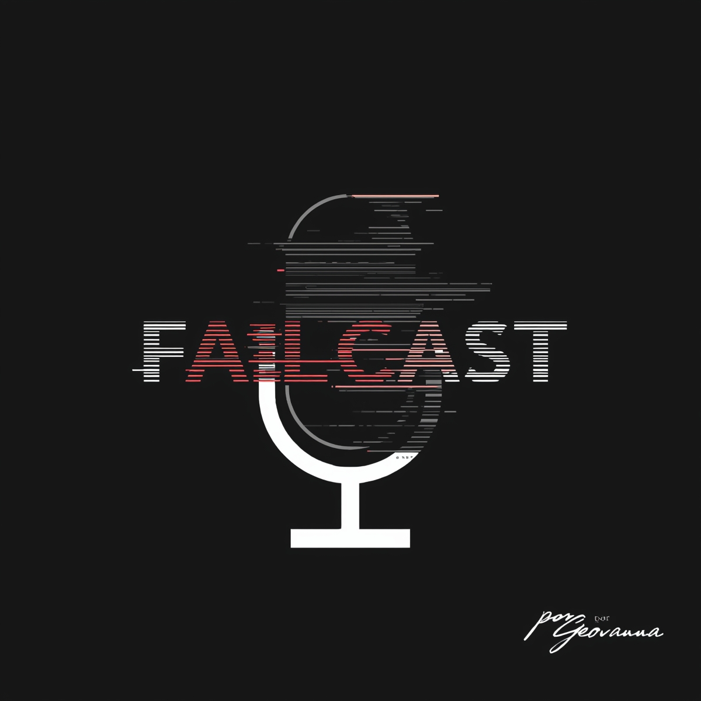

    preview do meu podcast 🎙️

    <audio src="audio/meu_podcast.mp3" controls title="Podcast editado"></audio>

# **Podcast IA — FAILCAST: O Lado B da Inovação**

> 💡 Este projeto foi desenvolvido como parte do desafio da [DIO](https://dio.me) para criar um podcast gerado por inteligências artificiais.

Neste projeto, utilizei diferentes ferramentas de IA para criar **roteiro, voz e capa**, aplicando o que aprendi sobre **prompts e automação criativa**.

---

## 💻 Tecnologias utilizadas

- [ChatGPT](https://chat.openai.com/) — criação de roteiro e ideias  
- [ElevenLabs](https://beta.elevenlabs.io/) — geração de voz  
- [Capcut](https://www.capcut.com/pt-br/) — edição de áudio  
- [Leonardo.AI](https://app.leonardo.ai/) — criação da capa  

---

## ✨ Como eu fiz

1. gerei o roteiro com o ChatGPT a partir de prompts criativos  
2. transformei o texto em áudio com ElevenLabs  
3. criei a capa com o Leonardo AI  
4. finalizei a edição no CapCut  

---

## 📚 Meus arquivos

- 🎧 [meu podcast](./output/EP%201.%20PILOTO.MP3)  
- 🖼️ [meus prompts para capa](./src/prompts/capa.md)  
- 🎬 [meus prompts para roteiro](./src/prompts/roteiro.md)
- 🎨 [capa do podcast](./assets/cover.png)

---

## 👩‍💻 Desenvolvido por

    
    
&nbsp&nbsp&nbsp<strong>Geovanna</strong> 
    &nbsp&nbsp&nbsp
    <a href="https://github.com/gebastos">GitHub</a>
    &nbsp;|&nbsp;
    <a href="https://www.linkedin.com/in/geovanna-bastos/">LinkedIn</a>
    

---

⌨️ com 🩷 por [Geovanna Bastos](https://github.com/gebastos)